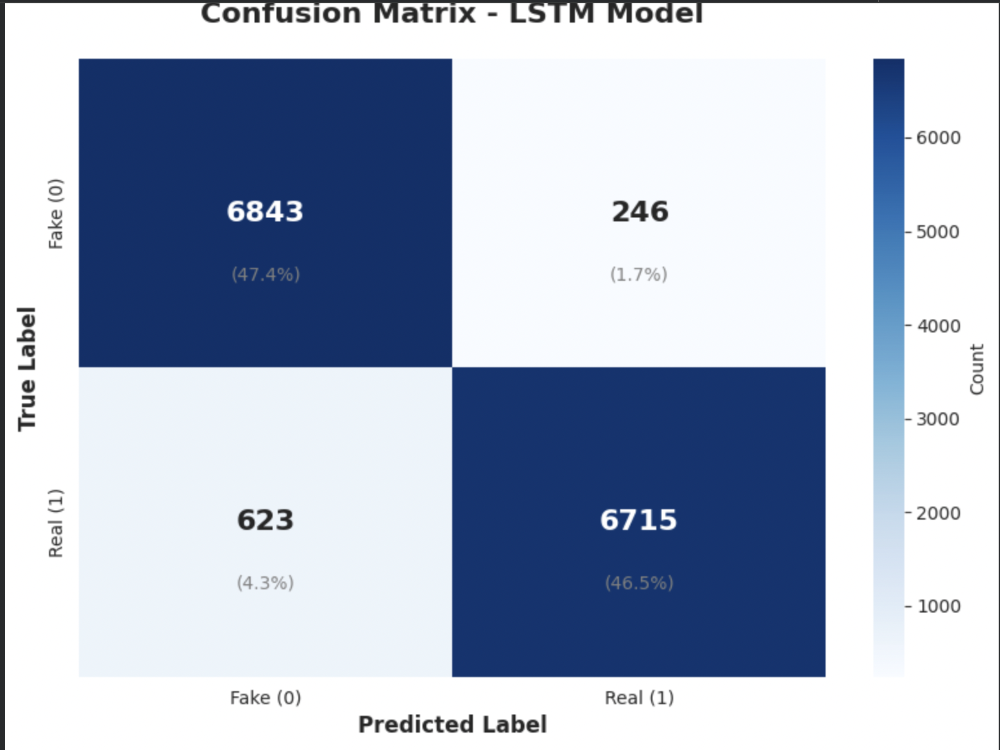
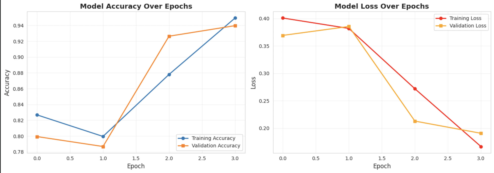

# Deep Fake Detection using Deep Learning Methods

A data science capstone project exploring machine learning approaches to detect fake news articles, with an innovative evidence-based enhancement using web search verification.

## Project Overview

This project implements and compares multiple deep learning approaches for fake news detection using the WELFake dataset. The system analyzes text content to classify articles as real or fake, achieving up to 95% accuracy with LSTM models.

### 🔹 Demo Video
To see the system in action, watch the demo video here:

### Demo Video
[Watch Demo](videos/demo.mov) (Unable to upload due to size but I will be posting on youtube so i can link to it soon) 


This short walkthrough demonstrates the interface, classification workflow, and evidence-retrieval process.

### Key Features
- **Multiple Model Architectures**: Comparison between Naive Bayes and LSTM-based approaches
- **Evidence-Based Enhancement**: Novel retrieval component that uses Google search to find corroborating evidence for article claims
- **High Accuracy**: Achieved 95% accuracy with optimized LSTM model

---

## Dataset

**WELFake Dataset** - A comprehensive fake news detection dataset combining multiple sources
- Contains real and fake news articles across various topics
- Balanced dataset for fair model evaluation

---

## Current Results

| Model | Accuracy |
|-------|----------|
| Naive Bayes | 82% |
| LSTM (RNN) | 93% |

### LSTM Model Performance

**Confusion Matrix**



The confusion matrix shows strong classification performance with:
- True Positives (Real detected as Real): 6,715 (46.5%)
- True Negatives (Fake detected as Fake): 6,843 (47.4%)
- False Positives: 623 (4.3%)
- False Negatives: 246 (1.7%)

**Training History**



The training curves demonstrate effective learning with minimal overfitting, reaching optimal performance around epoch 3.

### Planned Enhancement
Integration of a retrieval-based verification system that cross-references article content with real-world evidence from Google search results to provide additional validation signals.

---

## 🚀 **Live Deployed Model**

A fully deployable, interactive version of the fake news classifier is hosted on HuggingFace Spaces:

👉 **Live Web App:**  
https://ashvie-fakenewsdetector.hf.space/?__theme=system&deep_link=cQFbDLrYGrQ

**What it does:**  
- Accepts article text or pasted content  
- Runs the optimized LSTM model to classify as *Real* or *Fake*  
- Automatically retrieves Google search results to provide supporting or contradicting evidence  
- Displays confidence scores and relevant links  

This demo allows users to experience real-time automated fake news detection without running the code locally.

---

## Getting Started / Set Up

### Prerequisites
- Python 3.7 or higher
- Google Colab account (recommended) or local Python environment
- SerpAPI account (free tier available)

### Installation

#### Step 1: Set Up Your Environment

**Option A: Using Google Colab (Recommended)**
1. Go to [Google Colab](https://colab.research.google.com/)
2. Create a new notebook or upload the project notebook


**Option B: Local Setup**
```bash
# Clone this repository
git clone [your-repo-url]
cd [your-repo-name]

# Create a virtual environment (optional but recommended)
python -m venv venv
source venv/bin/activate  # On Windows: venv\Scripts\activate

# Install required packages
pip install -r requirements.txt
```

#### Step 2: Download the WELFake Dataset

```python
# Download the dataset directly in your notebook or script
import pandas as pd
import urllib.request

# WELFake dataset URL
dataset_url = "https://zenodo.org/record/4561253/files/WELFake_Dataset.csv"

# Download and load the dataset
urllib.request.urlretrieve(dataset_url, "WELFake_Dataset.csv")
df = pd.read_csv("WELFake_Dataset.csv")
```

Alternatively, manually download from [WELFake Dataset on Kaggle](https://www.kaggle.com/datasets/saurabhshahane/fake-news-classification?resource=download) and place in your project directory.

#### Step 3: Install Search API Dependencies

```bash
pip install google-search-results
```

#### Step 4: Set Up SerpAPI Access

1. Create a free account at [SerpAPI](https://serpapi.com/)
2. Navigate to your dashboard after signing in
3. Copy your unique API key from the API Key section
4. In the notebook/code, replace `secret_api_key` with your actual API key:

```python
# In your configuration file or notebook
SERPAPI_KEY = "your_actual_api_key_here"
```


#### Step 5: Run the Project

**In Google Colab:**
```python
# Open the main notebook
# Run all cells sequentially
```

**Locally:**
```bash
# Run the main script
python main.py

# Or launch Jupyter notebook
jupyter notebook
```


## Dependencies

Key libraries used in this project:
- `pandas` - Data manipulation
- `numpy` - Numerical computing
- `scikit-learn` - Naive Bayes implementation
- `tensorflow/keras` - LSTM model
- `google-search-results` - SerpAPI integration
- `nltk` - Natural language processing

See `requirements.txt` for complete list with versions.


##  Methodology

1. **Data Preprocessing**: Text cleaning, tokenization, and vectorization
2. **Baseline Model**: Naive Bayes classifier for initial benchmarking
3. **Advanced Model**: LSTM recurrent neural network for improved accuracy
4. **Enhancement**: Evidence retrieval system to cross-reference claims

##  Future Improvements

- Expand to multi-modal fake news detection
- Implement real-time classification API
- Add visualization dashboard for results


##  Author

[Ashlyn Viereck]  
[Creighton University]  
Data Science Capstone Project - [Fall/2025]


## Acknowledgments

- WELFake dataset creators
- Dr. Fernandes! 
- SerpAPI 


**Note**: This project is for educational purposes as part of a data science capstone course.
